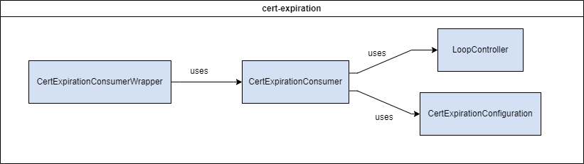

# Certificate Expiration


Traveler Information Messages (TIMs) are signed by a Hardware Security Module (HSM) to ensure identity verification and a high level of security. The HSM uses rotating certificates that are short-lived, with a maximum lifespan of two weeks. However, TIMs themselves can have varying lifespans, with some, like Variable Speed Limits (VSLs), remaining active for extended periods. The cert-expiration module monitors the Kafka topic topic.OdeTIMCertExpirationTimeJson and updates the ActiveTim records to accurately reflect the expiration of these certificates.

## Table of Contents
- [Installation](#installation)
- [Deployment](#deployment)
- [Configuration](#configuration)
- [Testing](#testing)
- [Usage](#usage)
- [Troubleshooting](#troubleshooting)

## Installation
These instructions will get you a copy of the project up and running on your local machine for development and testing purposes. See [deployment](#deployment) for notes on how to deploy the project on a live system.

### Docker
The following instructions are intended to be executed from the root directory of the TIMM project:
1. Reopen the project in the provided dev container by clicking on the blue button in the bottom left corner of the window and selecting "Reopen in Container"
1. Open a terminal in the dev container by clicking on the `Terminal` menu and selecting `New Terminal`
1. Compile the project by running the following command:
    ```
    mvn clean package -DskipTests -pl cv-data-service-library -pl cert-expiration
    ```
1. Reopen the project locally by clicking on the blue button in the bottom left corner of the window and selecting "Reopen Folder Locally"
1. Move the compiled JAR to the root directory of the module:

    Linux:
    ```bash
    mv ./cert-expiration/target/cert-expiration-x.x.x-SNAPSHOT.jar ./cert-expiration/
    ``` 
    Windows:
    ```windows
    move .\cert-expiration\target\cert-expiration-x.x.x-SNAPSHOT.jar .\cert-expiration\
    ```

    Replace `x.x.x` with the version number of the JAR file. If a JAR file already exists in the `cert-expiration` directory, you may need to delete it first.

1. Copy the sample.env to .env:

    Linux:
    ```bash
    cp sample.env .env
    ```
    Windows:
    ```windows
    copy sample.env .env
    ```

1. Update the .env file with the appropriate values. See the [Configuration](#configuration) section for more information.
1. Verify that Kafka is running and accessible at the address specified in the .env file.
1. If running integration tests, verify that the CV Data Controller, TIMM database & ODE service is running and accessible at the address specified in the .env file.
1. Build & run the docker container with the following command:
    ```
    docker compose up -d --build cert-expiration
    ```
1. View the logs with the following command:
    ```
    docker compose logs -f cert-expiration
    ```

    To stop viewing the logs, press `Ctrl+C`.

1. To stop the container, run the following command:
    ```
    docker compose down
    ```

### Launch Configuration
A basic development environment file has been included (/resource/application-dev.properties) and is used when debugging via the `Cert Expiration (Launch)` task.

To run the application using the provided launch configuration:
1. Open the project in the provided dev container by clicking on the blue button in the bottom left corner of the window and selecting "Reopen in Container"
1. Open the `Run` tab on the left side of the window
1. Click on the `Run and Debug` button at the top of the `Run` tab
1. Select the `Cert Expiration (Launch)` configuration from the dropdown menu
1. Verify that Kafka is running and accessible at the address specified in the .env file.
1. If running integration tests, verify that the CV Data Controller, TIMM database & ODE service is running and accessible at the address specified in the .env file.
1. Click the green play button to start the application

## Deployment
This application is deployed using Docker, and is part of the larger TIM Manager. The associated Dockerfile is configured for the development ODE environment. See the main [README](../README.md) for the project and associated [docker-compose](../docker-compose.yml), and [sample.env](../sample.env) file for further deployment configurations.

## Configuration
**SOME OF THESE PROPERTIES ARE SENSITIVE. DO NOT PUBLISH THEM TO VERSION CONTROL**

You may configure these values in `cert-expiration/src/main/resources/application.properties` or by editing them in the `sample.env` file at the project root. Environment variables will take precedence over values in the `application.properties` file when both are present.

**IMPORTANT** When using the env file method, you must rename or duplicate the `sample.env` file to `.env`. If using the application.properties method, you must pass in the name of the environment to use with the `--spring.profiles.active` parameter.

| Environment Variable | Variable name in `sample.env` | Property name in `application.properties` | Description                               | Example Value                                                  |
| -------------------- | ------------------------------ | ----------------------------------------- | ----------------------------------------- | -------------------------------------------------------------- |
| KAFKA_HOST_SERVER | LOGGER_KAFKA_HOST_SERVER | kafkaHostServer | IP address of the Kafka host machine | localhost |
| ENV | LOGGER_ENV | env | Configuration environment | dev |
| ALERT_ADDRESSES | LOGGER_ALERT_ADDRESSES | alertAddresses | List of email addresses to send alerts to | user@example.com,user2@example.com |
| FROM_EMAIL | LOGGER_FROM_EMAIL | fromEmail | Email to send alerts from | support@test.com |
| ENVIRONMENT_NAME | ENVIRONMENT_NAME | environmentName | Name of environment (for email subject) | DEV |
| MAIL_HOST | MAIL_HOST | mailHost | IP of mail host | localhost |
| MAIL_PORT | MAIL_PORT | mailPort | Port for mail host | 25 |
| DEPOSIT_TOPIC | EXP_TOPIC | depositTopic | Kafka topic for logger to subscribe to | topic.OdeTIMCertExpirationTimeJson |
| DEPOSIT_GROUP | EXP_GROUP | depositGroup | Kafka group name for subscriptions | certExpirationGroup |
| CV_REST_SERVICE | LOGGER_CV_REST_SERVICE | cvRestService | URL for the CV REST service | http://localhost:8080 |
| PRODUCER_TOPIC | DBCONSUMER_DEPOSIT_TOPIC | producerTopic | Topic consumed by logger-kafka-consumer | topic.OracleDataLogger |

## Testing
To run the unit tests, follow these steps:
1. Reopen the project in the provided dev container by clicking on the blue button in the bottom left corner of the window and selecting "Reopen in Container"
1. Open a terminal in the dev container
1. Run the following command to execute the tests:
    ```
    mvn clean test -pl cv-data-service-library -pl cert-expiration
    ```

## Usage
The system is designed to continuously run while consuming records from Kafka.

### Topic Info
The `topic.OdeTIMCertExpirationTimeJson` topic includes several datapoints to allow selecting a unique TIM from our ActiveTim table. The structure of the topic is:

    ```
    {
        "expirationDate": "2020-10-20T16:26:07.000Z",
        "packetID": "BF5A7CE7FE33D93991",
        "requiredExpirationDate": "2020-11-05T20:16:02.935Z",
        "startDateTime": "2020-10-14T14:56:02.935Z"
    }
    ```

## Troubleshooting
### ConfigException: No resolvable bootstrap urls given in bootstrap.servers
This error occurs when the Kafka server is not running or the address is incorrect. Verify that the Kafka server is running and accessible at the address specified in the .env file.