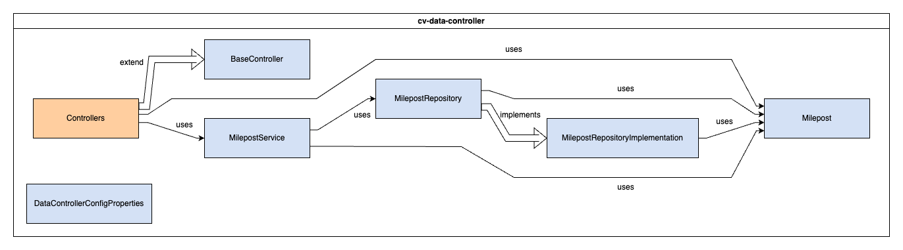

# CV Data Controller


The `cv-data-controller` module serves as the main interface for interacting with the TIMM database and communicating with the ODE. It exposes a RESTful API, which is utilized by several modules, including ODE Wrapper, Cert Expiration, Tim Refresh, and ODE Data Logger. The API supports various HTTP methods: GET to retrieve data, PUT and POST to update data, and DELETE to remove data from the TIMM database. Additionally, the controller includes a method for pushing data to the ODE.

## Table of Contents
- [Installation](#installation)
- [Deployment](#deployment)
- [Configuration](#configuration)
- [Testing](#testing)
- [Usage](#usage)
- [Troubleshooting](#troubleshooting)

## Installation
These instructions will get you a copy of the project up and running on your local machine for development and testing purposes. See [deployment](#deployment) for notes on how to deploy the project on a live system.

### Docker
The following instructions are intended to be executed from the root directory of the TIMM project:
1. Reopen the project in the provided dev container by clicking on the blue button in the bottom left corner of the window and selecting "Reopen in Container"
1. Open a terminal in the dev container by clicking on the `Terminal` menu and selecting `New Terminal`
1. Compile the project by running the following command:
    ```
    mvn clean package -DskipTests -pl cv-data-service-library -pl cv-data-controller
    ```
1. Reopen the project locally by clicking on the blue button in the bottom left corner of the window and selecting "Reopen Folder Locally"
1. Move the compiled JAR to the root directory of the module:

    Linux:
    ```bash
    mv ./cv-data-controller/target/cv-data-controller-x.x.x-SNAPSHOT.jar ./cv-data-controller/
    ``` 
    Windows:
    ```windows
    move .\cv-data-controller\target\cv-data-controller-x.x.x-SNAPSHOT.jar .\cv-data-controller\
    ```

    Replace `x.x.x` with the version number of the JAR file. If a JAR file already exists in the `cv-data-controller` directory, you may need to delete it first.

1. Copy the sample.env to .env:

    Linux:
    ```bash
    cp sample.env .env
    ```
    Windows:
    ```windows
    copy sample.env .env
    ```

1. Update the .env file with the appropriate values. See the [Configuration](#configuration) section for more information.
1. Verify that Kafka is running and accessible at the address specified in the .env file.
1. Verify that the postgres database is running and accessible at the address specified in the .env file.
1. If running integration tests with the ODE, verify that the ODE is running and accessible at the address specified in the .env file
1. Build & run the docker container with the following command:
    ```
    docker compose up -d --build cv-data-controller
    ```
1. View the logs with the following command:
    ```
    docker compose logs -f cv-data-controller
    ```

    To stop viewing the logs, press `Ctrl+C`.

1. To stop the container, run the following command:
    ```
    docker compose down
    ```

### Launch Configuration
A basic development environment file has been included (/resource/application-dev.properties) and is used when debugging via the `CV Data Controller (Launch)` task.

To run the application using the provided launch configuration, follow these steps:
1. Update the `application.properties` file with the appropriate values. See the [Configuration](#configuration) section for more information.
1. Verify that the postgres database is running and accessible at the address specified in the `application.properties` file.
1. If running integration tests with the ODE, verify that the ODE is running and accessible at the address specified in the .env file
1. Open the project in the provided dev container by clicking on the blue button in the bottom left corner of the window and selecting "Reopen in Container"
1. Open the Run and Debug sidebar by clicking on the icon on the left side of the window or by pressing `Ctrl+Shift+D`
1. Click on the gear icon in the top right corner of the sidebar
1. Select the `CV Data Controller (Launch)` configuration from the dropdown menu
1. Click the green play button to start the application

## Deployment
This application is deployed using Docker, and is part of the larger TIM Manager. The associated Dockerfile is configured for the development ODE environment. See the main [README](../README.md) for the project and associated [docker-compose](../docker-compose.yml), and [sample.env](../sample.env) file for further deployment configurations.

## Configuration <a name = "configuration"></a>
**SOME OF THESE PROPERTIES ARE SENSITIVE. DO NOT PUBLISH THEM TO VERSION CONTROL**

You may configure these values in `cv-data-controller/src/main/resources/application.properties` or by editing them in the `sample.env` file at the project root.

**IMPORTANT** When using the env file method, you must rename or duplicate the `sample.env` file to `.env`. If using the application.properties method, you must pass in the name of the environment to use with the `--spring.profiles.active` parameter.

| Environment Variable | Variable name in `sample.env` | Property name in `application.properties` | Description                               | Example Value                                                  |
| -------------------- | ------------------------------ | ----------------------------------------- | ----------------------------------------- | -------------------------------------------------------------- |
| SERVER_PORT | CONTROLLER_SERVER_PORT | server.port | Port to bind to | 8888 |
| CONFIG_DB_URL | CONTROLLER_CONFIG_DB_URL | config.dbUrl | Database URL | jdbc:postgresql://example.com:5432/dbname?user=username |
| CONFIG_DB_USERNAME | CONTROLLER_CONFIG_DB_USERNAME | config.dbUsername | Database username | username |
| CONFIG_DB_PASSWORD | CONTROLLER_CONFIG_DB_PASSWORD | config.dbPassword | Password for database user | password |
| CONFIG_MAXIMUM_POOL_SIZE | CONTROLLER_CONFIG_MAXIMUM_POOL_SIZE | config.maximumPoolSize | Number of threads in ThreadPool | 7 |
| CONFIG_CONNECTION_TIMEOUT | CONTROLLER_CONFIG_CONNECTION_TIMEOUT | config.connectionTimeout | Connection timeout in milliseconds | 10000 |
| CONFIG_ODE_URL | CONTROLLER_CONFIG_ODE_URL | config.odeUrl | URL pointing to the ODE | https://example.ode:8443 |
| CONFIG_ENV | CONTROLLER_CONFIG_ENV | N/A | Configuration environment | dev |
| SPRING_DATA_NEO4j_URI | CONTROLLER_SPRING_DATA_NEO4J_URI | spring.data.neo4j.uri | Graph database URL for single transaction | http://localhost:6474/db/data/transaction/commit |
| CONFIG_ALERT_ADDRESSES | CONTROLLER_CONFIG_ALERT_ADDRESSES | config.alertAddresses | List of email addresses to send alerts to | user@example.com,user2@example.com |
| CONFIG_FROM_EMAIL | CONTROLLER_CONFIG_FROM_EMAIL | config.fromEmail | Email to send alerts from | support@example.com |
| CONFIG_ENVIRONMENT_NAME | ENVIRONMENT_NAME | config.environmentName | Name of environment (for email subject) | DEV |
| CONFIG_MAIL_HOST | MAIL_HOST | config.mailHost | IP of mail host | localhost |
| CONFIG_MAIL_PORT | MAIL_PORT | config.mailPort | Port for mail host | 25 |
| SERVER_SSL_KEY_STORE | CONTROLLER_SERVER_SSL_KEY_STORE | server.ssl.key-store | **PROD ONLY** Keystore to pull from for ssl | classpath:keystore.jks |
| SERVER_SSL_KEY_STORE_PASSWORD | CONTROLLER_SERVER_SSL_KEY_STORE_PASSWORD | server.ssl.key-store-password | **PROD ONLY** Keystore password | pass |
| SERVER_SSL_KEY_STORE_TYPE | CONTROLLER_SERVER_SSL_KEY_STORE_TYPE | server.ssl.keyStoreType | **PROD ONLY** Keystore type (JKS) | JKS |
| SERVER_SSL_KEY_ALIAS | CONTROLLER_SERVER_SSL_KEY_ALIAS | server.ssl.keyAlias | **PROD ONLY** Alias for Keystore | example.alias |

## Testing
To run the unit tests, follow these steps:
1. Reopen the project in the provided dev container by clicking on the blue button in the bottom left corner of the window and selecting "Reopen in Container"
1. Open a terminal in the dev container
1. Run the following command to execute the tests:
    ```
    mvn clean test -pl cv-data-service-library -pl cv-data-controller
    ```

## Usage
The system may be called using standard HTTP GET/POST/PUT/DELETE methods. See [Postman](https://www.getpostman.com/) for HTTP method generation.

## Troubleshooting
### FATAL: bouncer config error
This error can occur for a number of reasons when attempting to access a remote database. The particular cause that was encountered in this project was the lack of user information in the database URL. The solution was to add the username to the URL as follows:
```
jdbc:postgresql://localhost:5432/dbname?user=username
```

It should be noted that the username must be lowercase.

### Failed to initialize pool: The connection attempt failed.
This error can occur when the database is not running or is not accessible. The solution is to verify that the database is running and accessible at the address specified in the .env file.