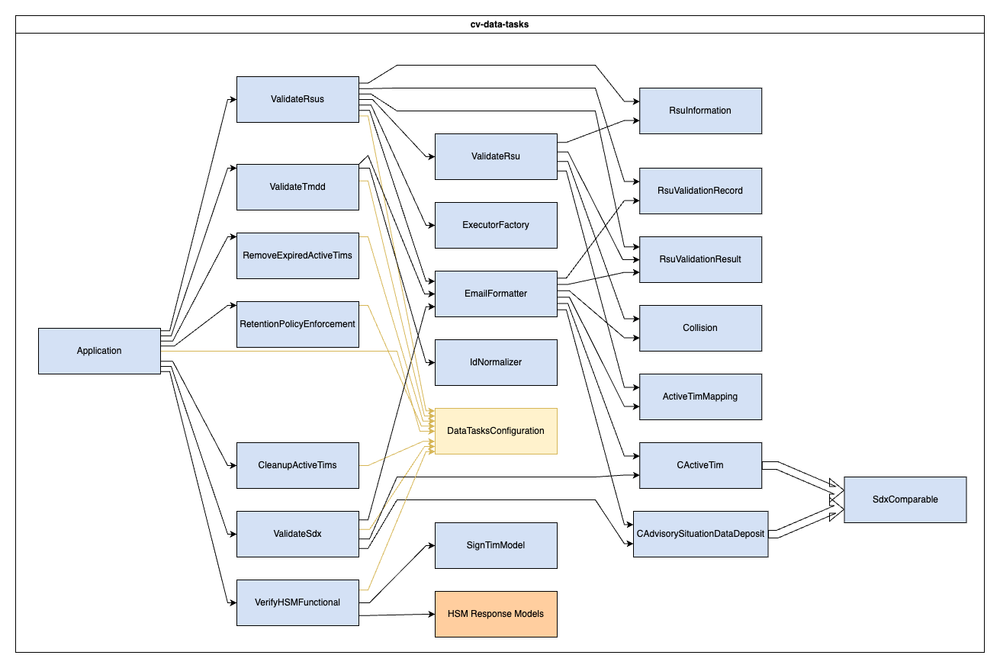

# Data Tasks


## Table of Contents

- [About](#about)
- [Getting Started](#getting-started)
- [Usage](#usage)
- [Testing](#testing)

## About

The cv-data-tasks application is used to clean up TIM messages from the database, RSUs and SDX. There are two main functionalities to the application, CleanupActiveTims and RemoveExpiredTims (as represented by each class under /actions).
CleanupActiveTims looks through the Database active_tim table to find TIMs missing ITIS codes or not distributed. RemoveExpiredTims looks through the Database active_tim table to find TIMs with a tim_end field less than the current time. Both cases call the `/delete-tim/` endpoint on the ODE Wrapper project.

## Getting Started

These instructions will get you a copy of the project up and running on your local machine for development and testing purposes. See [deployment](#deployment) for notes on how to deploy the project on a live system.

### Prerequisites

The data-tasks project relies on the cv-data-service-library for various functionality. This module is part of a solution encompassing that library and it should be build before building this one.

### Installing

A basic development environment file has been included (/resource/application-dev.properties) and is used when debugging via the `CV Data Tasks (Launch)` task.

It is possible to run this module outside the main solution. There is a pom.xml file used to work with Maven commands. To build this module individually run the following

**IMPORTANT** note the library must already be built

```
mvn clean install
```

## Advanced installation

In order to run the RSU validation logic, you'll need to create a custom launch settings file and environment configuration file. This is due to the fact that RSU validation requires records from both the dev and prod environments. To get started, merge the following to the [launch.json](../.vscode/launch.json) file:

```json
"configurations": [
    {
        "type": "java",
        "name": "CV Data Controller Prod (temp)",
        "request": "launch",
        "cwd": "${workspaceRoot}/cv-data-controller",
        "args": "--spring.profiles.active",
        "mainClass": "com.trihydro.cvdatacontroller.Application"
    }
],
"compounds": [
    {
        "name": "CV Data Tasks Compound Launch",
        "configurations": [
            "CV Data Tasks (Launch)",
            "CV Data Controller (Launch)",
            "CV Data Controller Prod (temp)"
        ]
    }
]
```

Finally, create a `application-prod.properties` file for the **cv-data-controller** in the `cv-data-controller/src/main/resources` directory. Add the following contents:

```
server.port
config.dbUrl
config.dbUsername
config.dbPassword
config.maximumPoolSize
config.connectionTimeout
```

Fill in the respective variables with prod values before running.

## Usage

The system is designed to use the Java ScheduledExecutorService and run every 4 hours to remove extraneous TIMs.

## Testing

Tests may be executed with

```
mvn test
```

## Deployment

This application is deployed using Docker, and is part of the larger TIM Manager. The associated Dockerfile is configured for the development ODE environment. See the main [README](../README.md) for the project and associated [docker-compose](../docker-compose.yml), and [sample.env](../sample.env) file for further deployment configurations.

# Configuration Reference

You may configure these values in `cv-data-tasks/src/main/resources/application.properties` or by editing them in the `sample.env` file at the project root.

**IMPORTANT** When using the env file method, you must You must rename or duplicate the `sample.env` file to `.env`. If using the application.properties method, you must pass in the name of the environment to use with the `--spring.profiles.active` parameter.

| Value in `application.properties`        | Value as env var (in sample.env)                  | Description                    | Example Value                     |
| ---------------------------------------- | ------------------------------------------------- | ------------------------------ | --------------------------------- |
| config.odeUrl                            | TASKS_CONFIG_ODE_URL                              | URL pointing to the ODE        | https://example.ode:8443  |
| config.cvRestService                     | TASKS_CONFIG_CV_REST_SERVICE                      | URL for the CV REST Service    | http://localhost:8888          |
| config.wrapperUrl                        | TASKS_CONFIG_WRAPPER_URL                          | URL for ODE Wrapper            | https://example.ode:7777  |
| config.rsuDataServiceUrl                 | TASKS_CONFIG_RSU_DATA_SERVICE_URL                 | RSU Service URL                | http://example.ode:8898   |
| config.sdwRestUrl                        | SDW_REST_URL                                      | URL for the SDX                | http://host.docker.internal:12230 |
| config.sdwApiKey                         | SDW_API_KEY                                       | SDX ODE User API Key           |                                   |
| config.alertAddresses                    | TASKS_CONFIG_ALERT_ADDRESSES                      | Who to email                   | user@example.com,user2@example.com      |
| config.fromEmail                         | TASKS_CONFIG_FROM_EMAIL                           | Sender of email                | support@example.com            |
| config.environmentName                   | TASKS_CONFIG_ENVIRONMENT_NAME                     | Name of environment            | DEV                               |
| config.mailHost                          | MAIL_HOST                                         | Mail Server IP                 | localhost                       |
| config.mailPort                          | MAIL_PORT                                         | Port for SMTP                  | 25                                |
| config.runTmddValidation                 | TASKS_CONFIG_RUN_TMDD_VALIDATION                  | Run or disable TMDD validation | true                              |
| config.runRsuValidation                  | TASKS_CONFIG_RUN_RSU_VALIDATION                   | Run or disable RSU validation  | true                              |
| config.rsuValThreadPoolSize              | TASKS_CONFIG_RSU_VAL_THREAD_POOL_SIZE             | # threads for RSU validation   | 4                                 |
| config.rsuValTimeoutSeconds              | TASKS_CONFIG_RSU_VAL_TIMEOUT_SECONDS              | Timeout for RSU validation     | 300                               |
| config.removeExpiredPeriodMinutes        | TASKS_CONFIG_REMOVE_EXPIRED_PERIOD_MINUTES        | How often to run               | 240                               |
| config.cleanupPeriodMinutes              | TASKS_CONFIG_CLEANUP_PERIOD_MINUTES               | How often to run               | 240                               |
| config.sdxValidationPeriodMinutes        | TASKS_CONFIG_SDX_VALIDATION_PERIOD_MINUTES        | How often to run               | 1440                              |
| config.rsuValidationPeriodMinutes        | TASKS_CONFIG_RSU_VALIDATION_PERIOD_MINUTES        | How often to run               | 1440                              |
| config.tmddValidationPeriodMinutes       | TASKS_CONFIG_TMDD_VALIDATION_PERIOD_MINUTES       | How often to run               | 1440                              |
| config.retentionEnforcementPeriodMinutes | TASKS_CONFIG_RETENTION_ENFORCEMENT_PERIOD_MINUTES | How often to run               | 1440                              |
