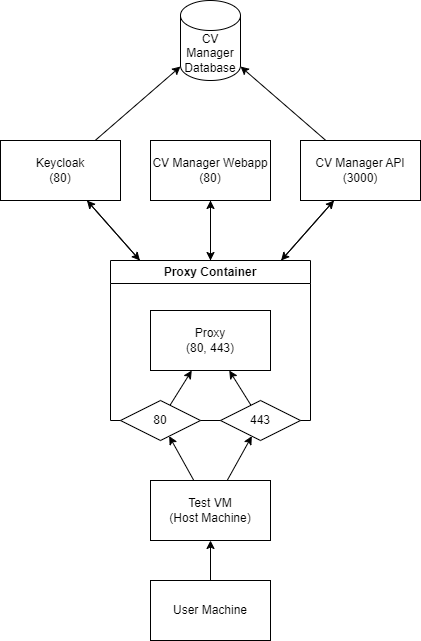

# Nginx Proxy
This directory contains the resources needed to run the Nginx proxy server.

## Diagram
The following diagram shows the context of the Nginx proxy server in the CVManager application.



## Resources
The following resources are available in this directory:
- `Dockerfile`: The Dockerfile used to build the Nginx proxy server image.
- `gen-dhparam.sh`: A script to generate the Diffie-Hellman parameters for the Nginx proxy server.
- `nginx-ssl.conf`: The Nginx configuration file for the SSL settings.

## Usage
The CV Manager `docker-compose.yml` file has been modified to include the Nginx proxy server as a service:

```yaml
  cvmanager_nginx_proxy:
    build:
      context: ../nginx_proxy_resources
    image: cvmanager_nginx_proxy:latest
    restart: unless-stopped
    ports:
      - 80:80
      - 443:443
    environment:
      NGINX_ENVSUBST_OUTPUT_DIR: /etc/nginx
      SERVER_HOST: ${WEBAPP_DOMAIN}
    volumes:
      - ../nginx_proxy_resources/nginx-ssl.conf:/etc/nginx/templates/nginx.conf.template
      - ../nginx_proxy_resources/gen_dhparam.sh:/docker-entrypoint.d/gen_dhparam.sh
      - ../nginx_proxy_resources/ssl/server.crt:/etc/ssl/certs/server.crt
      - ../nginx_proxy_resources/ssl/server.key:/etc/ssl/private/server.key
    depends_on:
      - cvmanager_webapp
      - cvmanager_keycloak
      - cvmanager_api
    logging:
      options:
        max-size: '10m'
        max-file: '5'
```
The directory specified as the build context contains the `Dockerfile` file to build the Nginx proxy server image. The `nginx-ssl.conf` file is mounted as a volume to the Nginx proxy server container. The `gen-dhparam.sh` script is mounted as an entrypoint script to generate the Diffie-Hellman parameters for the Nginx proxy server. The SSL certificates are also mounted as volumes to the Nginx proxy server container.

The Nginx proxy server is dependent on the `cvmanager_webapp`, `cvmanager_keycloak`, and `cvmanager_api` services. The `SERVER_HOST` environment variable is set to the `WEBAPP_DOMAIN` value.

The Nginx proxy server listens on ports 80 and 443 and is configured to use SSL for secure communication. Any traffic on port 80 is redirected to port 443.
