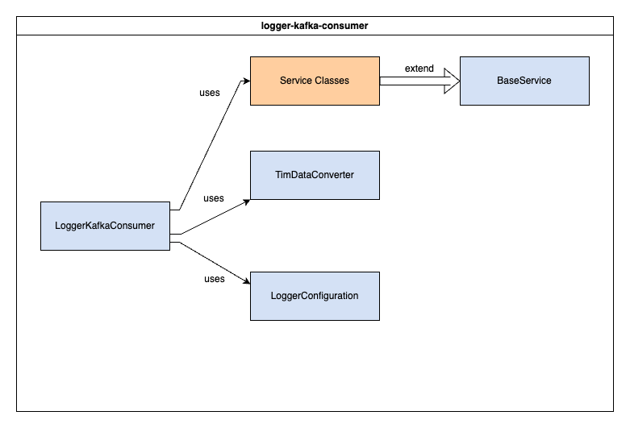

# Logger Kafka Consumer


The `logger-kafka-consumer` module is responsible for consuming messages from the Kafka topic `topic.OracleDataLogger` and handling them according to their message type.

For the expected format of consumed messages, see [Message Format](#message-format).

For actions that the consumer can take, see [Actions](#actions).

## Table of Contents
- [Installation](#installation)
- [Deployment](#deployment)
- [Configuration](#configuration)
- [Testing](#testing)
- [Usage](#usage)

## Installation
The following instructions are intended to be executed from the root directory of the TIMM project:
1. Open the project in the provided dev container
1. Compile the project by running the following command:
    ```bash
    mvn clean package -DskipTests -pl cv-data-service-library -pl logger-kafka-consumer
    ```
1. Reopen the project locally
1. Move the compiled JAR to the root directory of the module:
    ```bash
    mv ./logger-kafka-consumer/target/logger-kafka-consumer-1.0-SNAPSHOT.jar ./logger-kafka-consumer
    ```
1. Copy sample.env to `.env`:
    ```bash
    cp sample.env .env
    ```
1. Update the `.env` file with the appropriate values. See [Configuration](#configuration) for more information.
1. Verify that Kafka is running and accessible at the address specified in the `.env` file.
1. Build & run the docker container with the following command:
    ```bash
    docker compose up -d --build logger-kafka-consumer
    ```
1. View the logs with the following command:
    ```bash
    docker compose logs -f logger-kafka-consumer
    ```
1. To stop the container, run the following command:
    ```bash
    docker compose down logger-kafka-consumer
    ```

## Deployment
This application is deployed using Docker, and is part of the larger TIM Manager. The associated Dockerfile is configured for the development ODE environment. See the main [README](../README.md) for the project and associated [docker-compose](../docker-compose.yml), and [sample.env](../sample.env) file for further deployment configurations.

## Configuration
The following table describes the configurable environment variables for the module:
| Environment Variable | Variable name in `sample.env` | Property name in `application.properties` | Description                               | Example Value                                                  |
| -------------------- | ------------------------------ | ----------------------------------------- | ----------------------------------------- | -------------------------------------------------------------- |
| `DEPOSIT_GROUP` | DBCONSUMER_DEPOSIT_GROUP | depositGroup | The Kafka consumer group ID | certExpirationGroup | mygroup |
| `DEPOSIT_TOPIC` | DBCONSUMER_DEPOSIT_TOPIC | depositTopic | The Kafka topic to consume messages from | topic.OdeTIMCertExpirationTimeJson | topic.OracleDataLogger |
| `KAFKA_HOST_SERVER` | DBCONSUMER_KAFKA_HOST_SERVER | kafkaHostServer | The Kafka server to connect to | localhost |
| `MAX_POLL_INTERVAL_MS` | DBCONSUMER_MAX_POLL_INTERVAL_MS | maxPollIntervalMs | The maximum time in milliseconds the consumer is allowed to be idle | 300000 |
| `MAX_POLL_RECORDS` | DBCONSUMER_MAX_POLL_RECORDS | maxPollRecords | The maximum number of records returned in a single call to poll | 100 |
| `DB_URL` | DBCONSUMER_DB_URL | dbUrl | The URL of the database to connect to | jdbc:postgresql://localhost:5432/mydb |
| `DB_USERNAME` | DBCONSUMER_DB_USERNAME | dbUsername | The username to use when connecting to the database | myuser |
| `DB_PASSWORD` | DBCONSUMER_DB_PASSWORD | dbPassword | The password to use when connecting to the database | mypassword |
| `MAXIMUM_POOL_SIZE` | DBCONSUMER_MAXIMUM_POOL_SIZE | maximumPoolSize | The maximum number of connections to create | 10 |
| `CONNECTION_TIMEOUT` | DBCONSUMER_CONNECTION_TIMEOUT | connectionTimeout | The maximum time in milliseconds to wit for a connection to be established | 30000 |
| `ALERT_ADDRESSES` | DBCONSUMER_ALERT_ADDRESSES | alertAddresses | A comma-separated list of email addresses to send alerts to | user@example.com,user2@example.com |
| `FROM_EMAIL` | DBCONSUMER_FROM_EMAIL | fromEmail | The email address to send alerts from | support@example.com |
| `ENVIRONMENT_NAME` | ENVIRONMENT_NAME | environmentName | The name of the environment the module is running in | DEV |
| `MAIL_HOST` | MAIL_HOST | mailHost | The host of the email server to send alerts through | localhost |
| `MAIL_PORT` | MAIL_PORT | mailPort | The port of the email server to send alerts through | 587 |
| `ENV` | ENV | env | The environment the module is running in | dev |

## Testing
### Unit Tests
1. Reopen project in provided dev container
1. Run the following command to execute unit tests:
    ```bash
    mvn clean test -p cv-data-service-library -p logger-kafka-consumer
    ```

This will build the library that the module depends on and run the unit tests for the module (as well as the library).

## Usage
### Message Format
Consumed messages are expected to be in the following format:
```json
{
  "topic": "<original ODE output topic that the message came from>",
  "data": "<the message as json>"
}
```

Valid values for the `topic` field are:
- `topic.OdeTimJson
- `topic.OdeTimCertExpirationTimeJson

### Actions
The following table describes the message types the corresponding actions that are taken:

| Message Type | Action |
| --- | --- |
| `Traveler Information Message` | If generated by the TMC, the message is added to the active tim table. Otherwise, the message is added to the tim table. |
| `Ode TIM Cert Expiration Time` | The expiration for the relevant active TIM is updated. |