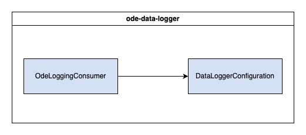

# WYDOT ODE Data Logger


This module is responsible for depositing Traveler Information Messages (TIMs) that are outputted from the ODE into an intermediary topic for later consumption by the Logger Kafka Consumer module. The default configuration is to listen for messages on the `topic.OdeTimJson` topic and deposit them into the `topic.OracleDataLogger` topic. 

## Table of Contents
- [Installation](#installation)
- [Deployment](#deployment)
- [Configuration](#configuration)
- [Testing](#testing)
- [Usage](#usage)

## Installation
These instructions will get you a copy of the project up and running on your local machine for development and testing purposes. See [deployment](#deployment) for notes on how to deploy the project on a live system.

### Dependencies
#### Runtime Dependencies
| Dependency | Direct/Indirect | Link |
| ---------- | --------------- | ---- |
| [Kafka](https://kafka.apache.org/) | Direct | [Apache](https://kafka.apache.org/) |
| [ODE](https://www.github.com/usdot-jpo-ode/jpo-ode) | Indirect | [GitHub](https://www.github.com/usdot-jpo-ode/jpo-ode) |

#### Compile-Time Dependencies
- Java is provided by the dev container's base image.
- Maven is provided by the dev container's base image.

### Docker
The following instructions are intended to be executed from the root directory of the TIMM project:
1. Reopen the project in the provided dev container by clicking on the blue button in the bottom left corner of the window and selecting "Reopen in Container". If Docker isn't running, start it and try again.
1. Open a terminal in the dev container by clicking on the `Terminal` menu and selecting `New Terminal`
1. Compile the project by running the following command:
    ```
    mvn clean package -DskipTests -pl cv-data-service-library -pl ode-data-logger
    ```
1. Reopen the project locally by clicking on the blue button in the bottom left corner of the window and selecting "Reopen Folder Locally"
1. Move the compiled JAR to the root directory of the module:

    Linux:
    ```bash
    mv ./ode-data-logger/target/ode-data-logger-x.x.x-SNAPSHOT.jar ./ode-data-logger/
    ```
    Windows:
    ```windows
    move .\ode-data-logger\target\ode-data-logger-x.x.x-SNAPSHOT.jar .\ode-data-logger\
    ```

    Replace `x.x.x` with the version number of the JAR file. If a JAR file already exists in the `ode-data-logger` directory, you may need to delete it first.

1. Copy the sample.env to .env:

    Linux:
    ```bash
    cp sample.env .env
    ```
    Windows:
    ```windows
    copy sample.env .env
    ```

1. Update the .env file with the appropriate values. See the [Configuration](#configuration) section for more information.
1. Verify that the necessary [dependencies](#dependencies) are running and accessible at the addresses specified in the `.env` file.
1. Build & run the docker container with the following command:
    ```
    docker compose up -d --build ode-data-logger
    ```
1. View the logs with the following command:
    ```
    docker compose logs -f ode-data-logger
    ```

    To stop viewing the logs, press `Ctrl+C`.

1. To stop the container, run the following command:
    ```
    docker compose down
    ```

### Launch Configuration
A basic development environment file has been included (src/main/resources/application-dev.properties) and is used when debugging via the `ODE Data Logger (Launch)` task.

To run the application using the provided launch configuration, follow these steps:
1. Update the `application.properties` file with the appropriate values. See the [Configuration](#configuration) section for more information.
1. Verify that the postgres database is running and accessible at the address specified in the `application.properties` file.
1. If running integration tests with the ODE, verify that the ODE is running and accessible at the address specified in the .env file
1. Open the project in the provided dev container by clicking on the blue button in the bottom left corner of the window and selecting "Reopen in Container"
1. Open the Run and Debug sidebar by clicking on the icon on the left side of the window or by pressing `Ctrl+Shift+D`
1. Click on down arrow next to the gear icon in the top right corner of the sidebar
1. Select the `ODE Data Logger (Launch)` configuration from the dropdown menu
1. Click the green play button to start the application

## Deployment
This application is deployed using Docker, and is part of the larger TIM Manager. The associated Dockerfile is configured for the development ODE environment. See the main [README](../README.md) for the project and associated [docker-compose](../docker-compose.yml), and [sample.env](../sample.env) file for further deployment configurations.

## Configuration
**SOME OF THESE PROPERTIES ARE SENSITIVE. DO NOT PUBLISH THEM TO VERSION CONTROL**

You may configure these values in `ode-data-logger/src/main/resources/application.properties` or by editing them in the `sample.env` file at the project root.

**IMPORTANT** When using the env file method, you must rename or duplicate the `sample.env` file to `.env`. If using the application.properties method, you must pass in the name of the environment to use with the `--spring.profiles.active` parameter.

| Environment Variable | Variable name in `sample.env` | Property name in `application.properties` | Description                               | Example Value                                                  |
| -------------------- | ------------------------------ | ----------------------------------------- | ----------------------------------------- | -------------------------------------------------------------- |
| KAFKA_HOST_SERVER | LOGGER_KAFKA_HOST_SERVER | kafkaHostServer | IP address of the Kafka host machine | 172.0.0.1 |
| ENV | LOGGER_ENV | env | Configuration environment | dev |
| ALERT_ADDRESSES | LOGGER_ALERT_ADDRESSES | alertAddresses | List of email addresses to send alerts to | test@gmail.com |
| FROM_EMAIL | LOGGER_FROM_EMAIL | fromEmail | Email to send alerts from | test@gmail.com |
| ENVIRONMENT_NAME | ENVIRONMENT_NAME | environmentName | Name of environment (for email subject) | Test |
| MAIL_HOST | MAIL_HOST | mailHost | IP of mail host | 8.8.8.8 |
| MAIL_PORT | MAIL_PORT | mailPort | Port for mail host | 25 |
| DEPOSIT_TOPIC | TIM_TOPIC | depositTopic | Kafka topic for logger to subscribe to | topic.OdeTimJson |
| DEPOSIT_GROUP | TIM_GROUP_ORACLE | depositGroup | Kafka group name for subscriptions | group.OracleDataLogger |
| CV_REST_SERVICE | LOGGER_CV_REST_SERVICE | cvRestService | URL for CV Data Controller REST service | http://localhost:7777 |
| PRODUCER_TOPIC | DBCONSUMER_DEPOSIT_TOPIC | producerTopic | Kafka topic for producer to send messages to | topic.OracleDataLogger |

## Testing
### Unit Testing
To run the unit tests, follow these steps:
1. Reopen the project in the provided dev container by clicking on the blue button in the bottom left corner of the window and selecting "Reopen in Container"
1. Open a terminal in the dev container
1. Run the following command to execute the tests:
    ```
    mvn clean test -pl cv-data-service-library -pl ode-data-logger
    ```

## Usage
While the application is running, it will listen for messages on the `topic.OdeTimJson` topic and deposit them into the `topic.OracleDataLogger` topic (with the default configuration). The application will also send alerts to the specified email addresses if an error occurs.

To push a message to the `topic.OdeTimJson` topic, you can use the [kcat](https://github.com/edenhill/kcat) command line tool. The following command will push a message to the topic:
```
echo '{"data": "test"}' | kcat -b localhost:9092 -P -t topic.OdeTimJson
```