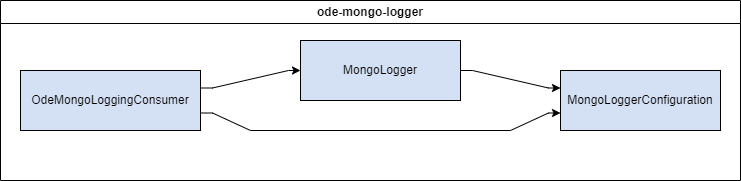

# WYDOT ODE Data Logger


The `ODE Mongo Logger` module listens for messages on a specified Kafka topic and writes them to a MongoDB database. The module is designed to be deployed as a Docker container and is part of the TIM Manager of applications.

## Table of Contents
- [Installation](#installation)
- [Deployment](#deployment)
- [Configuration](#configuration)
- [Testing](#testing)
- [Usage](#usage)

## Installation
These instructions will get you a copy of the project up and running on your local machine for development and testing purposes. See [deployment](#deployment) for notes on how to deploy the project on a live system.

### Runtime Dependencies
| Dependency | Direct/Indirect | Link |
| ---------- | --------------- | ---- |
| [Kafka](https://kafka.apache.org/) | Direct | [Kafka](https://kafka.apache.org/) |
| [MongoDB Server](https://www.mongodb.com/) | Direct | [MongoDB](https://www.mongodb.com/) |

### Compile-Time Dependencies
- Java is provided by the dev container's base image.
- Maven is provided by the dev container's base image.

### Docker
The following instructions are intended to be executed from the root directory of the TIMM project:
1. Reopen the project in the provided dev container by clicking on the blue button in the bottom left corner of the window and selecting "Reopen in Container". If Docker isn't running, start it and try again.
1. Open a terminal in the dev container by clicking on the `Terminal` menu and selecting `New Terminal`
1. Compile the project by running the following command:
    ```
    mvn clean package -DskipTests -pl cv-data-service-library -pl ode-mongo-logger
    ```
1. Reopen the project locally by clicking on the blue button in the bottom left corner of the window and selecting "Reopen Folder Locally"
1. Move the compiled JAR to the root directory of the module:

    Linux:
    ```bash
    mv ./ode-mongo-logger/target/ode-mongo-logger-x.x.x-SNAPSHOT.jar ./ode-mongo-logger/
    ```
    Windows:
    ```windows
    move .\ode-mongo-logger\target\ode-mongo-logger-x.x.x-SNAPSHOT.jar .\ode-mongo-logger\
    ```

    Replace `x.x.x` with the version number of the JAR file. If a JAR file already exists in the `ode-mongo-logger` directory, you may need to delete it first.

1. Copy the sample.env to .env:

    Linux:
    ```bash
    cp sample.env .env
    ```
    Windows:
    ```windows
    copy sample.env .env
    ```

1. Update the .env file with the appropriate values. See the [Configuration](#configuration) section for more information.
1. Verify that the necessary [dependencies](#dependencies) are running and accessible at the addresses specified in the `.env` file.
1. Build & run the docker container with the following command:
    ```
    docker compose up -d --build tim_logger_mongo
    ```
1. View the logs with the following command:
    ```
    docker compose logs -f tim_logger_mongo
    ```

    To stop viewing the logs, press `Ctrl+C`.

1. To stop the container, run the following command:
    ```
    docker compose down
    ```

### Launch Configuration
A basic development environment file has been included (/resource/application-dev.properties) and is used when debugging via the `ODE Mongo Logger (Launch)` configuration. This configuration is intended to be used with the provided dev container.

To run the application using the provided launch configuration, follow these steps:
1. Update the `application.properties` file with the appropriate values. See the [Configuration](#configuration) section for more information.
1. Verify that the necessary [dependencies](#dependencies) are running and accessible at the addresses specified in the `application.properties` file.
1. Open the project in the provided dev container by clicking on the blue button in the bottom left corner of the window and selecting "Reopen in Container"
1. Open the Run and Debug sidebar by clicking on the icon on the left side of the window or by pressing `Ctrl+Shift+D`
1. Click on down arrow next to the gear icon in the top right corner of the sidebar
1. Select the `ODE Mongo Logger (Launch)` configuration from the dropdown menu
1. Click the green play button to start the application

## Deployment
This application is deployed using Docker, and is part of the larger TIM Manager. The associated Dockerfile is configured for the development ODE environment. See the main [README](../README.md) for the project and associated [docker-compose](../docker-compose.yml), and [sample.env](../sample.env) file for further deployment configurations.

## Configuration
**SOME OF THESE PROPERTIES ARE SENSITIVE. DO NOT PUBLISH THEM TO VERSION CONTROL**

You may configure these values in `ode-mongo-logger/src/main/resources/application.properties` or by editing them in the `sample.env` file at the project root.

**IMPORTANT** When using the env file method, you must rename or duplicate the `sample.env` file to `.env`. If using the application.properties method, you must pass in the name of the environment to use with the `--spring.profiles.active` parameter.

| Environment Variable | Variable name(s) in `sample.env` | Property name in `application.properties` | Description                               | Example Value                                                  |
| -------------------- | ------------------------------ | ----------------------------------------- | ----------------------------------------- | -------------------------------------------------------------- |
| MONGOLOGGER_DEPOSIT_TOPIC | TIM_TOPIC, BSM_TOPIC, DA_TOPIC | mongologger.depositTopic                  | The Kafka topic to listen for messages on | topic.OdeTimJson                                            |
| MONGOLOGGER_DEPOSIT_GROUP | TIM_GROUP_MONGO, BSM_GROUP_MONGO, DA_GROUP_MONGO | mongologger.depositGroup                  | The Kafka consumer group to use           | logger_group_tim_dev_local                                            |
| MONGOLOGGER_HOSTNAME | MONGO_HOSTNAME | mongologger.hostname                       | The hostname of the machine that the mongo logger is running on         | localhost                                                    |
| MONGOLOGGER_MONGO_HOST | MONGO_HOST | mongologger.mongoHost                      | The hostname of the MongoDB server         | localhost                                                    |
| MONGOLOGGER_MONGO_DATABASE | MONGO_DATABASE | mongologger.mongoDatabase                       | The name of the MongoDB database to write to | wyo_cv                                                      |
| MONGOLOGGER_MONGO_AUTH_DATABASE | MONGO_AUTH_DATABASE | mongologger.mongoAuthDatabase             | The name of the MongoDB authentication database | admin                                                      |
| MONGOLOGGER_MONGO_USERNAME | MONGO_USERNAME | mongologger.mongoUsername                 | The username to use to connect to MongoDB  | admin                                                       |
| MONGOLOGGER_MONGO_PASSWORD | MONGO_PASSWORD | mongologger.mongoPassword                 | The password to use to connect to MongoDB  | password                                                    |
| MONGOLOGGER_ALERT_ADDRESSES | MONGO_ALERT_ADDRESSES | mongologger.alertAddresses                | The email addresses to send alerts to      | test@gmail.com                                               |
| MONGOLOGGER_FROM_EMAIL | MONGO_FROM_EMAIL | mongologger.fromEmail                      | The email address to send alerts from      | test@gmail.com                                               |
| MONGOLOGGER_ENVIRONMENT_NAME | ENVIRONMENT_NAME | mongologger.environmentName              | The name of the environment the logger is running in | dev                                                      |
| MONGOLOGGER_MAIL_HOST | MAIL_HOST | mongologger.mailHost                      | The hostname of the SMTP server to use for sending alerts | smtp.gmail.com                                            |
| MONGOLOGGER_MAIL_PORT | MAIL_PORT | mongologger.mailPort                      | The port of the SMTP server to use for sending alerts | 587                                                        |

## Testing
### Unit Tests
1. Reopen project in provided dev container
1. Run the following command to execute unit tests:
    ```bash
    mvn clean test -p cv-data-service-library -p ode-mongo-logger
    ```

This will build the library that the module depends on and run the unit tests for the module (as well as the library).

## Usage
This module requires a Kafka broker and MongoDB server to be running. The module listens for messages on a specified Kafka topic and writes them to a MongoDB database.

Once configured and running, no further action is required.