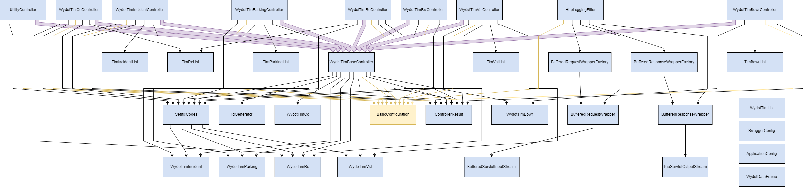

# WYDOT ODE Wrapper


The `ode-wrapper` module is a simplified API Endpoint wrapper around the ODE that allows users to create and manage Traveler Information Messages (TIMs) from WYDOT Applications. The module is responsible for managing the creation, updating, and deletion of TIMs via the ODE.

## Table of Contents
- [Installation](#installation)
- [Deployment](#deployment)
- [Configuration](#configuration)
- [Testing](#testing)
- [Usage](#usage)

## Installation
These instructions will get you a copy of the project up and running on your local machine for development and testing purposes. See [deployment](#deployment) for notes on how to deploy the project on a live system.

### Runtime Dependencies
| Dependency | Direct/Indirect | Link |
| ---------- | --------------- | ---- |
| [CV Data Controller](../cv-data-controller/README.md) | Direct | [README](../cv-data-controller/README.md) |
| [TIMM Database](../db-scripts/pgsql) | Direct | [PGSQL Scripts](../db-scripts/pgsql) |
| [ODE](https://www.github.com/usdot-jpo-ode/jpo-ode) | Indirect | [GitHub](https://www.github.com/usdot-jpo-ode/jpo-ode) |

### Compile-Time Dependencies
- Java is provided by the dev container's base image.
- Maven is provided by the dev container's base image.
- ODE JARs are installed using [post-create.sh](../.devcontainer/post-create.sh).

### Docker
The following instructions are intended to be executed from the root directory of the TIMM project:
1. Reopen the project in the provided dev container by clicking on the blue button in the bottom left corner of the window and selecting "Reopen in Container". If Docker isn't running, start it and try again.
1. Open a terminal in the dev container by clicking on the `Terminal` menu and selecting `New Terminal`
1. Compile the project by running the following command:
    ```
    mvn clean package -DskipTests -pl cv-data-service-library -pl ode-wrapper
    ```
1. Reopen the project locally by clicking on the blue button in the bottom left corner of the window and selecting "Reopen Folder Locally"
1. Move the compiled JAR to the root directory of the module:

    Linux:
    ```bash
    mv ./ode-wrapper/target/ode-wrapper-x.x.x-SNAPSHOT.jar ./ode-wrapper/
    ```
    Windows:
    ```windows
    move .\ode-wrapper\target\ode-wrapper-x.x.x-SNAPSHOT.jar .\ode-wrapper\
    ```

    Replace `x.x.x` with the version number of the JAR file. If a JAR file already exists in the `ode-wrapper` directory, you may need to delete it first.

1. Copy the sample.env to .env:

    Linux:
    ```bash
    cp sample.env .env
    ```
    Windows:
    ```windows
    copy sample.env .env
    ```

1. Update the .env file with the appropriate values. See the [Configuration](#configuration) section for more information.
1. Verify that the necessary [dependencies](#dependencies) are running and accessible at the addresses specified in the `.env` file.
1. Build & run the docker container with the following command:
    ```
    docker compose up -d --build ode_wrapper
    ```
1. View the logs with the following command:
    ```
    docker compose logs -f ode_wrapper
    ```

    To stop viewing the logs, press `Ctrl+C`.

1. To stop the container, run the following command:
    ```
    docker compose down
    ```

### Launch Configuration
A basic development environment file has been included (/resource/application-dev.properties) and is used when debugging via the `ODE Wrapper (Launch)` and `Wrapper Compound Launch` configurations.

#### Solo Launch
To run the application using the provided launch configuration, follow these steps:
1. Update the `application.properties` file with the appropriate values. See the [Configuration](#configuration) section for more information.
1. Verify that the necessary [dependencies](#dependencies) are running and accessible at the addresses specified in the `application.properties` file.
1. Open the project in the provided dev container by clicking on the blue button in the bottom left corner of the window and selecting "Reopen in Container"
1. Open the Run and Debug sidebar by clicking on the icon on the left side of the window or by pressing `Ctrl+Shift+D`
1. Click on down arrow next to the gear icon in the top right corner of the sidebar
1. Select the `ODE Wrapper (Launch)` configuration from the dropdown menu
1. Click the green play button to start the application

#### Compound Launch
To run the application and the cv-data-controller using the provided compound launch configuration, follow these steps:
1. Update the `application.properties` file for the ODE Wrapper with the appropriate values. See the [Configuration](#configuration) section for more information.
1. Configure `application.properties` file for the cv-data-controller module with the appropriate values. See the [cv-data-controller README](../cv-data-controller/README.md) for more information.
1. Verify that the necessary [dependencies](#dependencies) are running and accessible at the addresses specified in the `application.properties` file.
1. Open the project in the provided dev container by clicking on the blue button in the bottom left corner of the window and selecting "Reopen in Container"
1. Open the Run and Debug sidebar by clicking on the icon on the left side of the window or by pressing `Ctrl+Shift+D`
1. Click on down arrow next to the gear icon in the top right corner of the sidebar
1. Select the `Wrapper Compound Launch` configuration from the dropdown menu
1. Click the green play button to start the application

## Deployment
This application is deployed using Docker, and is part of the larger TIM Manager. The associated Dockerfile is configured for the development ODE environment. See the main [README](../README.md) for the project and associated [docker-compose](../docker-compose.yml), and [sample.env](../sample.env) file for further deployment configurations.

## Configuration
**SOME OF THESE PROPERTIES ARE SENSITIVE. DO NOT PUBLISH THEM TO VERSION CONTROL**

You may configure these values in `ode-wrapper/src/main/resources/application.properties` or by editing them in the `sample.env` file at the project root.

**IMPORTANT** When using the env file method, you must You must rename or duplicate the `sample.env` file to `.env`. If using the application.properties method, you must pass in the name of the environment to use with the `--spring.profiles.active` parameter.

| Environment Variable | Variable name in `sample.env` | Property name in `application.properties` | Description                               | Example Value                                                  |
| -------------------- | ------------------------------ | ----------------------------------------- | ----------------------------------------- | -------------------------------------------------------------- |
| SERVER_PORT          | WRAPPER_SERVER_PORT            | server.port                               | Server port to run on                     | 7777                                                           |
| CONFIG_ODE_URL       | WRAPPER_CONFIG_ODE_URL         | config.odeUrl                             | URL pointing to the ODE                   | https://example.com:8443                                |
| CONFIG_DB_URL        | WRAPPER_CONFIG_DB_URL           | config.dbUrl                              | Database URL                              | jdbc:postgresql://example.com:5432/dbname                        |
| CONFIG_DB_USERNAME   | WRAPPER_CONFIG_DB_USERNAME      | config.dbUsername                         | Database username                         | dbuser                                                         |
| CONFIG_DB_PASSWORD   | WRAPPER_CONFIG_DB_PASSWORD      | config.dbPassword                         | Password for database user                | dbpassword                                                     |
| CONFIG_MAXIMUM_POOL_SIZE | WRAPPER_CONFIG_MAXIMUM_POOL_SIZE | config.maximumPoolSize                  | Number of threads in ThreadPool           | 7                                                              |
| CONFIG_CONNECTION_TIMEOUT | WRAPPER_CONFIG_CONNECTION_TIMEOUT | config.connectionTimeout               | Connection timeout in milliseconds        | 10000                                                          |
| CONFIG_ENV           | WRAPPER_CONFIG_ENV              | config.env                                | Configuration environment                 | dev                                                            |
| CONFIG_SDW_TTL       | WRAPPER_CONFIG_SDW_TTL          | config.sdwTtl                             | SDW time to live default                  | oneday                                                         |
| CONFIG_SDW_REST_URL  | SDW_REST_URL                    | config.sdwRestUrl                         | REST endpoint for SDX                     | https://sdx-endpoint.com                           |
| CONFIG_SDW_API_KEY   | SDW_API_KEY                     | config.sdwApiKey                          | API Key for accessing SDX                 | asdf                                                           |
| CONFIG_ALERT_ADDRESSES | WRAPPER_CONFIG_ALERT_ADDRESSES | config.alertAddresses                    | List of email addresses to send alerts to | user@example.com,user2@example.com                    |
| CONFIG_FROM_EMAIL    | WRAPPER_CONFIG_FROM_EMAIL       | config.fromEmail                          | Email to send alerts from                 | support@example.com                                           |
| CONFIG_MAIL_HOST | MAIL_HOST | config.mailHost | IP of mail host | example.com |
| CONFIG_MAIL_PORT | MAIL_PORT | config.mailPort | Port for mail host | 25 |
| CONFIG_ENVIRONMENT_NAME | ENVIRONMENT_NAME | config.environmentName | Name of environment (for email subject) | DEV |
| CONFIG_DEFAULT_LANE_WIDTH | WRAPPER_CONFIG_DEFAULT_LANE_WIDTH | config.defaultLaneWidth | Default lane width for TIMs | 50 |
| CONFIG_CV_REST_SERVICE | WRAPPER_CONFIG_CV_REST_SERVICE | config.cvRestService | Endpoint for cv-data-controller | http://example.com:8888 |
| CONFIG_POINT_INCIDENT_BUFFER_MILES | WRAPPER_CONFIG_POINT_INCIDENT_BUFFER_MILES | config.pointIncidentBufferMiles | Buffer to add to point incidents | 1 |
| SERVER_SSL_KEY_STORE | WRAPPER_SERVER_SSL_KEY_STORE | server.ssl.key-store | Keystore to pull from for ssl | classpath:mykeystore.jks |
| SERVER_SSL_KEY_STORE_PASSWORD | WRAPPER_SERVER_SSL_KEY_STORE_PASSWORD | server.ssl.key-store-password | Keystore password | pass |
| SERVER_SSL_KEY_STORE_TYPE | WRAPPER_SERVER_SSL_KEY_STORE_TYPE | server.ssl.keyStoreType | Keystore type (JKS) | JKS |
| SERVER_SSL_KEY_ALIAS | WRAPPER_SERVER_SSL_KEY_ALIAS | server.ssl.keyAlias | Alias for Keystore | keystorealias |                                         |

## Testing
### Unit Testing
To run the unit tests, follow these steps:
1. Reopen the project in the provided dev container by clicking on the blue button in the bottom left corner of the window and selecting "Reopen in Container"
1. Open a terminal in the dev container
1. Run the following command to execute the tests:
    ```
    mvn clean test -pl cv-data-service-library -pl ode-wrapper
    ```

## Usage
The system may be called using standard HTTP GET methods. See [Postman](https://www.getpostman.com/) for HTTP method generation