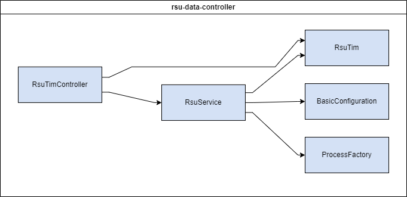

# RSU Data Controller


The rsu-data-controller module is a RESTful API to interact with RSUs. The methods available are complementary to the methods supplied by the ODE (such as `/tim/query`). This service is meant to provide additional RSU commands that aren't available in the scope of the ODE.

## Table of Contents
- [Installation](#installation)
- [Deployment](#deployment)
- [Configuration](#configuration)
- [Testing](#testing)
- [Usage](#usage)

## Installation
These instructions will get you a copy of the project up and running on your local machine for development and testing purposes. See [deployment](#deployment) for notes on how to deploy the project on a live system.

### Runtime Dependencies
(| Dependency | Direct/Indirect | Link |
| ---------- | --------------- | ---- |)
| SNMP | Direct | [SNMP](https://en.wikipedia.org/wiki/Simple_Network_Management_Protocol) |

### Compile-Time Dependencies
- Java is provided by the dev container's base image.
- Maven is provided by the dev container's base image.

### Docker
The following instructions are intended to be executed from the root directory of the TIMM project:
1. Reopen the project in the provided dev container by clicking on the blue button in the bottom left corner of the window and selecting "Reopen in Container". If Docker isn't running, start it and try again.
1. Open a terminal in the dev container by clicking on the `Terminal` menu and selecting `New Terminal`
1. Compile the project by running the following command:
    ```
    mvn clean package -DskipTests -pl cv-data-service-library -pl rsu-data-controller
    ```
1. Reopen the project locally by clicking on the blue button in the bottom left corner of the window and selecting "Reopen Folder Locally"
1. Move the compiled JAR to the root directory of the module:

    Linux:
    ```bash
    mv ./rsu-data-controller/target/rsu-data-controller-x.x.x-SNAPSHOT.jar ./rsu-data-controller/
    ```
    Windows:
    ```windows
    move .\rsu-data-controller\target\rsu-data-controller-x.x.x-SNAPSHOT.jar .\rsu-data-controller\
    ```

    Replace `x.x.x` with the version number of the JAR file. If a JAR file already exists in the `rsu-data-controller` directory, you may need to delete it first.

1. Copy the sample.env to .env:

    Linux:
    ```bash
    cp sample.env .env
    ```
    Windows:
    ```windows
    copy sample.env .env
    ```

1. Update the .env file with the appropriate values. See the [Configuration](#configuration) section for more information.
1. Verify that the necessary [dependencies](#dependencies) are running and accessible at the addresses specified in the `.env` file.
1. Build & run the docker container with the following command:
    ```
    docker compose up -d --build rsu-data-controller
    ```
1. View the logs with the following command:
    ```
    docker compose logs -f rsu-data-controller
    ```

    To stop viewing the logs, press `Ctrl+C`.

1. To stop the container, run the following command:
    ```
    docker compose down
    ```

### Launch Configuration
A basic development environment file has been included (/resource/application-dev.properties) and is used when debugging via the `RSU Data Controller (Launch)` configuration. This configuration is intended to be used with the provided dev container.

To run the application using the provided launch configuration, follow these steps:
1. Update the `application.properties` file with the appropriate values. See the [Configuration](#configuration) section for more information.
1. Verify that the necessary [dependencies](#dependencies) are running and accessible at the addresses specified in the `application.properties` file.
1. Open the project in the provided dev container by clicking on the blue button in the bottom left corner of the window and selecting "Reopen in Container"
1. Open the Run and Debug sidebar by clicking on the icon on the left side of the window or by pressing `Ctrl+Shift+D`
1. Click on down arrow next to the gear icon in the top right corner of the sidebar
1. Select the `RSU Data Controller (Launch)` configuration from the dropdown menu
1. Click the green play button to start the application

## Deployment
This application is deployed using Docker, and is part of the larger TIM Manager. The associated Dockerfile is configured for the development ODE environment. See the main [README](../README.md) for the project and associated [docker-compose](../docker-compose.yml), and [sample.env](../sample.env) file for further deployment configurations.

## Configuration
>SOME OF THESE PROPERTIES ARE SENSITIVE. DO NOT PUBLISH THEM TO VERSION CONTROL

You may configure these values in [application-dev.properties](./src/main/resources/application-dev.properties) or by supplying them as environment variables.

| Environment Variable | Variable name(s) in `sample.env` | Property name in `application.properties` | Description | Example Value |
| -------------------- | --------------------------------- | ----------------------------------------- | ----------- | ------------- |
| SERVER_PORT          | RSUCONTROLLER_SERVER_PORT          | server.port                               | Port to bind to | 8898 |
| CONFIG_SNMP_RETRIES         | RSUCONTROLLER_CONFIG_SNMP_RETRIES  | config.snmpRetries                        | Number of times to try SNMP cmds | 3 |
| CONFIG_SNMP_TIMEOUT_SECONDS  | RSUCONTROLLER_CONFIG_SNMP_TIMEOUT_SECONDS | config.snmpTimeoutSeconds            | Time to wait for each SNMP cmd | 15 |
| CONFIG_SNMP_USER_NAME        | RSUCONTROLLER_CONFIG_SNMP_USER_NAME       | config.snmpUserName                  | User to authenticate with | user |
| CONFIG_SNMP_AUTH_PASSPHRASE  | RSUCONTROLLER_CONFIG_SNMP_AUTH_PASSPHRASE | config.snmpAuthPassphrase            | Password to authenticate with | password |
| CONFIG_SNMP_AUTH_PROTOCOL    | RSUCONTROLLER_CONFIG_SNMP_AUTH_PROTOCOL   | config.snmpAuthProtocol              | Hashing scheme for password | SHA |
| CONFIG_SNMP_SECURITY_LEVEL   | RSUCONTROLLER_CONFIG_SNMP_SECURITY_LEVEL  | config.snmpSecurityLevel             | Use encrypted connection or not | authNoPriv |

## Testing
### Unit Tests
1. Reopen project in provided dev container
1. Run the following command to execute unit tests:
    ```bash
    mvn clean test -p cv-data-service-library -p rsu-data-controller
    ```

This will build the library that the module depends on and run the unit tests for the module (as well as the library).

## Usage
To run and debug the service, run the `RSU Data Controller (Launch)` VS Code profile. By default, this will expose a HTTP service on port 8898. You can then use _Postman_ (or a similar API client) to interact with the service.

Due to firewall restrictions, users may not be able to run this service locally and target RSUs. For this reason, it may be necessary to run SNMP commands on a server and then emulate the output in a unit test to ensure the service behaves as expected (see [RsuServiceTest.java](./src/test/java/com/trihydro/rsudatacontroller/service/RsuServiceTest.java))