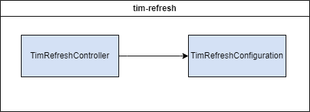

# TIM Refresh


Traveler Information Messages (TIMs) have varying lifespans; some, like Variable Speed Limits (VSLs), can remain active for long periods. However, the signature that validates a TIM expires after two weeks. The `tim-refresh` module is designed to refresh TIMs that are still valid but have reached the two-week signature expiration limit.

Each time the refresh task runs, the following steps are taken:
1. Active TIMs that are expiring within 24 hours are retrieved from the TIMM database. The query excludes TIMs with a start time more than 24 hours in the future and TIMs with an end time less than 24 hours in the future.
1. The retrieved TIMs are validated. This check considers TIMs invalid if they are missing a start point, direction or route.
1. The expiration date for each TIM is reset to 'null' in the TIMM database.
1. Each TIM gets their TIM start time updated and is re-submitted to the ODE.
1. If any errors, invalid TIMs or exceptions are encountered, an email is sent to the configured alert addresses.

By default, the refresh task runs once a day at 1 AM.

## Table of Contents
- [Installation](#installation)
- [Deployment](#deployment)
- [Configuration](#configuration)
- [Testing](#testing)
- [Usage](#usage)

## Installation
These instructions will get you a copy of the project up and running on your local machine for development and testing purposes. See [deployment](#deployment) for notes on how to deploy the project on a live system.

### Docker
The following instructions are intended to be executed from the root directory of the TIMM project:
1. Reopen the project in the provided dev container by clicking on the blue button in the bottom left corner of the window and selecting "Reopen in Container"
1. Open a terminal in the dev container by clicking on the `Terminal` menu and selecting `New Terminal`
1. Compile the project by running the following command:
    ```
    mvn clean package -DskipTests -pl cv-data-service-library -pl tim-refresh
    ```
1. Move the compiled JAR to the root directory of the module:

    Linux:
    ```bash
    mv ./tim-refresh/target/tim-refresh-x.x.x-SNAPSHOT.jar ./tim-refresh/
    ``` 
    Windows:
    ```windows
    move .\tim-refresh\target\tim-refresh-x.x.x-SNAPSHOT.jar .\tim-refresh\
    ```

    Replace `x.x.x` with the version number of the JAR file. If a JAR file already exists in the `tim-refresh` directory, you may need to delete it first.

1. Copy the sample.env to .env:

    Linux:
    ```bash
    cp sample.env .env
    ```
    Windows:
    ```windows
    copy sample.env .env
    ```

1. Update the .env file with the appropriate values. See the [Configuration](#configuration) section for more information.
1. If running integration tests, verify that Kafka is running and accessible at the address specified in the .env file.
1. If running integration tests, verify that the ODE is running and accessible at the address specified in the .env file.
1. Build & run the docker container with the following command:
    ```
    docker compose up -d --build tim-refresh
    ```
1. View the logs with the following command:
    ```
    docker compose logs -f tim-refresh
    ```

To stop viewing the logs, press `Ctrl+C`.

1. To stop the container, run the following command:
    ```
    docker compose down
    ```

### Launch Configuration
A basic development environment file has been included (/resource/application-dev.properties) and is used when debugging via the `TIM Refresh (Launch)` task.

To run the application using the provided launch configuration, follow these steps:
1. Open the project in the provided dev container by clicking on the blue button in the bottom left corner of the window and selecting "Reopen in Container"
1. Open the Run and Debug sidebar by clicking on the icon on the left side of the window or by pressing `Ctrl+Shift+D`
1. Click on the gear icon in the top right corner of the sidebar
1. Select the `TIM Refresh (Launch)` configuration from the dropdown menu
1. If running integration tests, verify that the CV Data Controller and the TIMM database are running and accessible at the addresses specified in the .env file
1. If running integration tests, verify that the ODE is running and accessible at the address specified in the .env file
1. Click the green play button to start the application

## Deployment
This application is deployed using Docker, and is part of the larger TIM Manager. The associated Dockerfile is configured for the development ODE environment. See the main [README](../README.md) for the project and associated [docker-compose](../docker-compose.yml), and [sample.env](../sample.env) file for further deployment configurations.

## Configuration
**SOME OF THESE PROPERTIES ARE SENSITIVE. DO NOT PUBLISH THEM TO VERSION CONTROL**

You may configure these values in `tim-refresh/src/main/resources/application.properties` or by editing them in the `sample.env` file at the project root.

**IMPORTANT** When using the env file method, you must rename or duplicate the `sample.env` file to `.env`. If using the application.properties method, you must pass in the name of the environment to use with the `--spring.profiles.active` parameter.


| Environment Variable | Variable name in `sample.env` | Property name in `application.properties` | Description                               | Example Value                                                  |
| -------------------- | ------------------------------ | ----------------------------------------- | ----------------------------------------- | -------------------------------------------------------------- |
| CONFIG_ODE_URL       | REFRESH_CONFIG_ODE_URL         | config.odeUrl                             | URL pointing to the ODE                   | https://ode-url:8443                               |
| CONFIG_SDW_TTL       | REFRESH_CONFIG_SDW_TTL         | config.sdwttl                             | SDW time to live                          | oneyear                                                        |
| CONFIG_CV_REST_SERVICE | REFRESH_CONFIG_CV_REST_SERVICE | config.cvRestService                     | URL for the CV REST Service               | http://<cv-rest-service-url>
| CONFIG_SDW_REST_URL  | SDW_REST_URL                   | config.sdwresturl                         | REST endpoint for SDX                     | https://sdx-url.com                           |
| CONFIG_SDW_API_KEY   | SDW_API_KEY                    | config.sdwapikey                          | API Key for accessing SDX                 | apikey                                                           |
| CONFIG_DEFAULT_LANE_WIDTH | REFRESH_CONFIG_DEFAULT_LANE_WIDTH | config.defaultlanewidth               | Default lane width of TIM                 | 50                                                             |
| CONFIG_RSU_ROUTES | REFRESH_CONFIG_RSU_ROUTES | config.rsuRoutes | List of RSU routes to refresh | 287, 789, 789A |
| CONFIG_POINT_INCIDENT_BUFFER_MILES | REFRESH_POINT_INCIDENT_BUFFER_MILES | config.pointIncidentBufferMiles | Buffer to add to point incidents | 1 |
| CRON_EXPRESSION | REFRESH_CRON_EXPRESSION | cron_expression | Cron expression to run refresh app | 0 0 1 * * ? |
| CONFIG_ENV | REFRESH_CONFIG_ENV | config.environmentName | Name of environment (for email subject) | DEV |
| CONFIG_ALERT_ADDRESSES | REFRESH_CONFIG_ALERT_ADDRESSES | config.alertAddresses | List of email addresses to send alerts to | user@example.com,user2@example.com |
| CONFIG_FROM_EMAIL | REFRESH_CONFIG_FROM_EMAIL | config.fromEmail | Email to send alerts from | support@example.com |
| CONFIG_MAIL_HOST | MAIL_HOST | config.mailHost | IP of mail host | localhost
| CONFIG_MAIL_PORT | MAIL_PORT | config.mailPort | Port for mail host | 25

## Testing
To run the unit tests, follow these steps:
1. Reopen the project in the provided dev container by clicking on the blue button in the bottom left corner of the window and selecting "Reopen in Container"
1. Open a terminal in the dev container
1. Run the following command to execute the tests:
    ```
    mvn clean test -pl cv-data-service-library -pl tim-refresh
    ```

## Usage
The system is designed to use the Spring `@Scheduled` functionality and run based on a passed in cron expression. It is recommended to run this function once a day.
